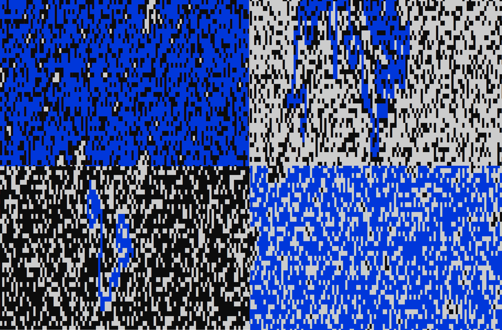

# Flood Fill

### Introduction

Inspired by a common coding challenge the Flood Fill project aims to change specific values within a matrix using depth-first search. A spawn coordinate is provided, the value of the spawn coordinate and all its neighbors with the same value within the matrix are converted into a new value. An example of this problem is seen within Microsoft's paint fill bucket tool where all pixels connected to the selected pixel with the fill bucket are converted into a new color.

The **LeetCode Flood Fill** problem can be found [Here](https://leetcode.com/problems/flood-fill/)

**Gallary**

